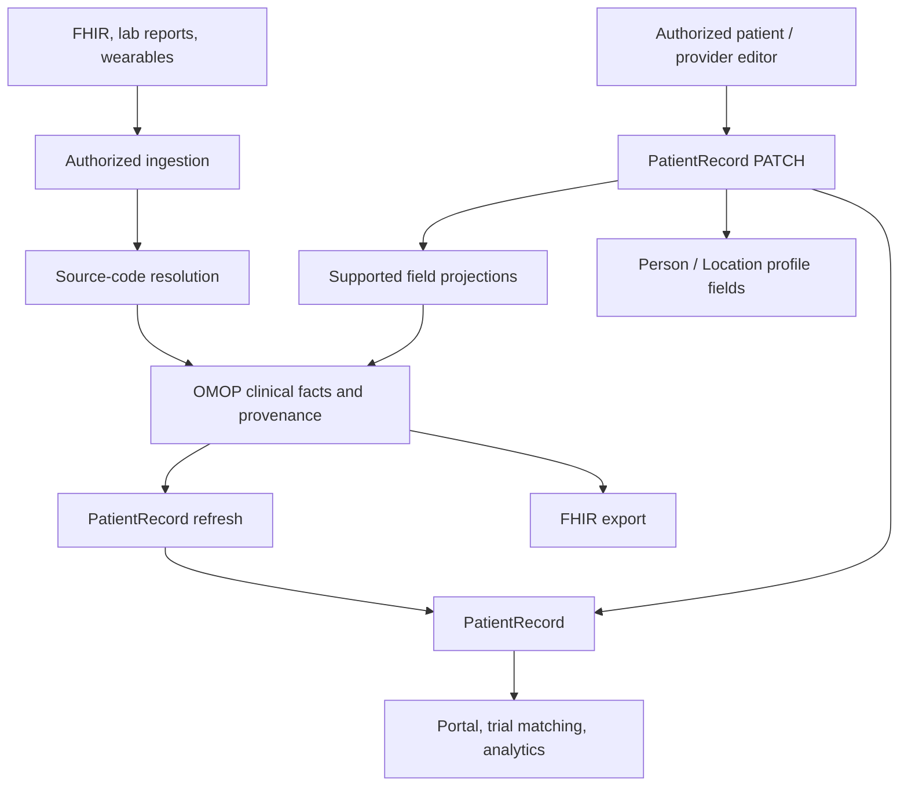

# PRomop: architecture and documentation guide

PRomop connects incoming health data, a longitudinal OMOP record, and the patient
view used by clinicians, patients, trial matching, and analytics. The documents
below follow that journey: establish identity and access, normalize source data,
store clinical facts, build and edit PatientRecord, then expose and operate the
result. Each linked guide owns the details of its part of the system.

Start with the [PRomop Developer Guide (PowerPoint)](../PRomop_Developer_Guide.pptx)
for a presentation overview, then use the guides below for implementation details.

For a working local installation, begin with the [repository README](../README.md)
and continue through the [load-and-query quickstart](quickstart.md).
[Docker](BUILDING_WITH_DOCKER.md) and [Linux setup](linux-setup.md) cover alternate
local environments. The [paper](../paper.md) explains the research motivation;
[benchmark reproduction](reproducing-benchmark-results.md) supplies the methods,
commands, and derivation field reference behind the reported results.

## The two paths into patient state

Imports and interactive edits meet at PatientRecord through different save paths.
An importer supplies source clinical events to OMOP. An authorized editor saves
writable PatientRecord fields, and the backend projects supported values onward.

The [PatientRecord-first write architecture](patient-record-first-writes.md)
defines interactive saves, mapping-approval backfill, and preservation of pending
edits during refresh. Direct saves recompute dependent values without a full OMOP
refresh. Computed fields and structured resources have specific ownership rules;
for example, treatment-course dialogs and Genomics own their discrete records.
The [field mapping reference](field_concept_mapping_architecture.md) connects UI controls,
PatientRecord keys, OMOP destinations, and remaining mapping gaps.

## 1. Establish who can act on which records

[Application roles](application-roles.md) is the current privilege reference for
Staff, Org Admin, Doctor, Analyst, and Patient. Authentication, service scopes,
organization membership, patient groups, and verified representation constrain
access in addition to the role itself.

Read [identity architecture](identity-architecture.md) for the identity model and
cross-service context, then [organization administration](org_admin.md) for
administration workflows. [Patient role and organization access](patient-role-org-access-architecture.md)
explains patient invitations, signup, and own-record routing. For credentials,
use [service application administration](service-application-admin.md) and the
[service-token migration guide](service-token-migration.md). The
[legacy bearer-token policy](bearer_token_security.md) covers the retained
shared-token configuration. The [login reference](LOGIN_INFO.md) lists login,
logout and health-check endpoints.

The identity document includes original cross-service designs and future work.
Use the current role and credential references above for implemented privileges
and attribution rules.

## 2. Translate source data into clinical facts

An OMOP concept gives a source value a shared meaning. [Vocabularies](vocabularies.md)
explains the loaded Athena corpus, local vocabularies, and required loading order.
[Concept mapping](concept-mapping.md) explains the vocabulary graph and how clinical
codes support ingestion and derivation. Importer implementations should follow
[Code Mapping API](code-mapping-api.md): source-code encounters resolve through
SCCM, and proposed destinations await curation before becoming effective mappings.

Three related mapping concerns have distinct responsibilities:

| Concern | Purpose | Primary reference |
| --- | --- | --- |
| Source-code mapping | Resolve an incoming code to an effective OMOP destination | [Code Mapping API](code-mapping-api.md) |
| Field mapping | Describe how an editable/displayed patient field relates to stored facts | [Field mapping reference](field_concept_mapping_architecture.md) |
| Therapy mapping | Relate regimens, components, classes, diseases, and treatment rounds | [Therapy reference tables](therapy-reference-tables-architecture.md) |

The active [field-and-answer mapping plan](field_concept_mapping_plan.md)
tracks the inventory, scoped choices, coded-answer projection and remaining
disease-specific repairs. Its next prerequisite is the complete field/value
inventory in #1223. The plan's [1.3RC gates](field_concept_mapping_plan.md#13-release-gates)
distinguish current RC verification from the deferred mapping backlog and
production rollout. Its [continuation instructions](field_concept_mapping_plan.md#continue-implementation-on-another-machine)
identify the pushed checkpoint and the next inventory acceptance work.

The [Mapping component](mapping-component-plan.md) defines the shared Python
service boundary and remaining refactoring work. The [code-mapping architecture
record](superpowers/plans/2026-08-30-code-mapping-direction.md) explains design
choices; its historical problem statements defer to the current API contract.
[Semantic retrieval](semantic-retrieval.md) documents suggestion strategies and
embedding setup. [HealthTree destination review](healthtree-destination-review.md)
and [Seen-count imports](healthtree-seen-counts.md) cover source-specific curation.

The large [combined crossmap](code-concept-mappings.md),
[HealthTree crossmap](ht-code-concept-mapping.md), and
[CureHub FHIR crossmap](ht-fhir-code-concept-mapping.md) are generated data artifacts.
Import/build commands depend on these files, including their different source
coverage; regenerate them with their documented commands rather than editing rows.

## 3. Preserve the event, then derive the patient view

[Clinical event time](clinical-event-time-policy.md) distinguishes when something
happened from when it was imported. [Clinical units](clinical-unit-policy.md)
separates source measurements from normalized presentation values. These policies
matter whenever facts from multiple sources contribute to the same patient field.

[Patient file uploads](patient-file-upload.md) describes file-routing behavior.
[Lab-result deduplication](lab-results-dedup-architecture.md) explains how repeated
uploads share measurements while retaining upload ownership and deletion behavior.
[Wearable-to-OMOP mapping](wearable-omop-mapping.md) covers device normalization,
metric identity, and known gaps. [Decision-ready wearables](decision-ready-wearables.md)
provides the longer clinical and product narrative behind that implementation.

Refresh builds the reusable patient projection from these facts.
[Async derivation](async-derivation-celery-plan.md) explains queued refresh and
status polling; [the API reference](API_SURFACE.md) describes the public calls.
The [derivation changelog](DERIVATION_CHANGELOG.md) records versioned changes.
[Legacy projection reconciliation](patient-record-projection-reconciliation.md)
is a narrowly scoped repair runbook for old numeric values with independently
verified event dates. Current editor behavior belongs to the PatientRecord-first
write guide, and [adding fields](adding_fields.md) is the delivery checklist
for extending it.

## 4. Add the clinical detail that a flat summary cannot carry

Therapy and genomics retain structured clinical evidence beneath their displayed
summaries. [Episode-backed treatment](episode-artemis-treatment-plan.md) describes
treatment-field ownership and the ARTEMIS delivery plan. The
[ARTEMIS execution runbook](runbooks/artemis.md) produces a reviewed result artifact;
the [Episode adapter](artemis_episode_adapter.md) materializes accepted results into
Episode and EpisodeEvent records. [Therapy reference tables](therapy-reference-tables-architecture.md)
provide the curated selection data used by therapy authoring.

For inference rationale, the [LOT design](superpowers/specs/2026-05-16-lot-inference-design.md),
[Athena/ARTEMIS design](superpowers/specs/2026-05-17-athena-vocabulary-artemis-design.md),
and [HemOnc classification design](superpowers/specs/2026-05-17-artemis-hemonc-lot-design.md)
record the algorithm's development. Use [HemOnc status and roadmap](hemonc-roadmap.md)
for the wider program and [ADR 0002](adr/0002-omop-therapy-types.md) for therapy
class semantics. The [field/value plan](field_concept_mapping_plan.md#therapy-type-consumer-delivery)
tracks consumer delivery and rollout. The ADR's
[feasibility output](adr/0002-phase0-coverage.txt) is historical supporting evidence.

[Implemented Genomics architecture](genomics_architecture.md) is the current
storage and ownership reference. [Genomics implementation](genomics_plan.md)
separately tracks remaining requirements, acceptance criteria, and deployment work.

## 5. Deliver patient and integration workflows

The [PHR architecture](phrs-fm-architecture.md) connects the patient account,
own-record access, consent, messaging, and clinical lists. [PROlog surveys](prolog-surveys.md)
describes the current survey runner and migration from the old survey feature.
[Patient list review views](patient-list-review-views.md) covers review workflows;
the [organization disease-statistics design](superpowers/specs/2026-06-20-org-disease-stats-design.md)
provides the original reporting design context.

Applications consume patient state through the [API surface](API_SURFACE.md).
[FHIR export](fhir-export-architecture.md) describes patient download and integration
exports. [Webhook notifications](webhooks_architecture.md) cover the push
direction: signed inbound events, organization-scoped subscriptions, transactional
delivery, and retention; who may configure a destination and what the payload
counts as are decided in [egress authority](soc2/webhook-egress-authority.md)
and [payload classification](soc2/webhook-payload-classification.md). Consumers that need a local vocabulary mirror use the
[vocabulary cache protocol](vocab-consumer-cache-protocol.md); [ADR 0001](adr/0001-vocabulary-source-of-truth.md)
records vocabulary authority and distribution decisions. The
[field/value plan](field_concept_mapping_plan.md#vocabulary-distribution-and-mapping-provenance)
tracks delivery and shared ratification.

The PHR functional-model documents have distinct purposes:
[oncology profile](phrs-fm-onco-profile.md) defines the intended scope,
[traceability](phrs-fm-traceability.md) maps requirements to implementation and
verification, and [conformance claim](phrs-fm-conformance-claim.md) states the
supported claim and its limits. Read them together with the delivered architecture.

## 6. Operate, verify, and extend the system

Staging means Render: **[promop-staging](https://promop-staging.onrender.com)**,
with the `promop-staging-worker` worker. [Render staging configuration](render-staging-celery.md)
is the operational guide; [production configuration](render-production-configuration.md)
covers production startup and environment requirements. [Security settings](security-settings.md),
[signing-key rotation](signing-key-rotation.md), and [Sentry](sentry.md) cover runtime
controls and monitoring. The [security remediation plan](promop-security-soc2-remediation-plan.md)
tracks implemented controls and outstanding operator evidence.

For representative test data, use [synthetic patient generation](SYNTHETIC_PATIENT_GENERATION.md),
including stage backfill, and [sample disease-status backfill](sample-patient-disease-status.md).
[mCODE/Synthea import](mcode-synthea-import.md) documents the separate Synthea cohort
route. [Benchmark reproduction](reproducing-benchmark-results.md) connects those
inputs to measured projection and eligibility workloads.

[Contributing](../CONTRIBUTING.md) covers development and tests.
[Changelog](../CHANGELOG.md) records releases. The
[Release 1.2 runbook](release-1.2-dev-to-main-runbook.md) retains release-specific
checkpoints and migration gates; its saved status is not evidence of the currently
deployed revision. Repository working conventions are in [AGENTS.md](../AGENTS.md)
and agent implementation guidance is in [CLAUDE.md](../CLAUDE.md).
[Code of conduct](../CODE_OF_CONDUCT.md) and [third-party notices](../THIRD_PARTY_NOTICES.md)
cover participation and attribution.

Reference guides and implementation plans live in `docs/`. Repository entry
points, agent instructions (`AGENTS.md` and `CLAUDE.md`), contribution and policy
files, and the research paper remain at the root for discovery and tooling.
