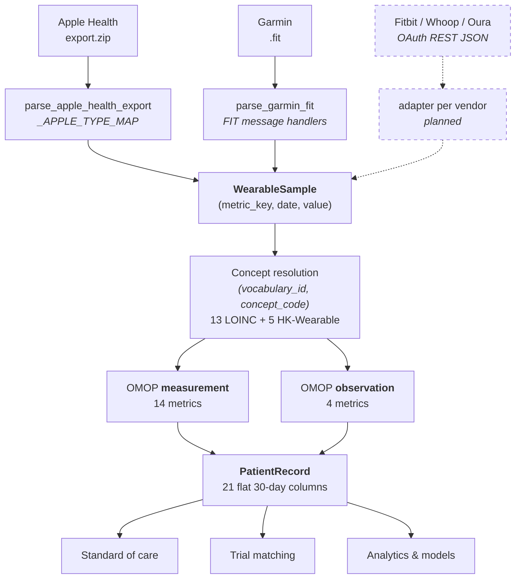

# Decision-Ready Wearables: One Clinical Layer Across Every Device

*How PROMOP normalizes consumer wearable data into OMOP CDM v5.4 and LOINC, and why that
normalization is what turns a step count into something a clinician, a trial coordinator, or a
model can actually act on.*

> **On scope.** The architecture described here is device-agnostic by construction. Apple Health
> and Garmin are the two adapters implemented in the codebase today, so they are what this article
> uses for concrete examples — real HealthKit identifiers, real FIT message names, real concept
> ids. Fitbit, Whoop, and Oura are planned and fit the same three-layer model without changing
> anything below the parser boundary. The section
> [Beyond Apple and Garmin](#beyond-apple-and-garmin-what-a-new-device-actually-costs) sets out
> precisely what a new device adds and what it doesn't.

---

## The problem is not the data. It's that every vendor has its own of everything.

An Apple Watch, a Garmin Fenix, a Fitbit Charge, a Whoop strap, and an Oura ring all measure
resting heart rate. They all do it reasonably well. What they do not do is agree on how to say so.

Apple exports an XML record typed `HKQuantityTypeIdentifierRestingHeartRate`. Garmin writes a
binary FIT file containing a `monitoring_hr_data` message with a `resting_heart_rate` field — and
on devices that don't emit that message at all, nothing, just an all-day stream of
`monitoring.heart_rate` samples from which resting HR has to be inferred. Fitbit, Whoop, and Oura
each serve their own JSON from their own OAuth-gated REST API, with their own field names, their
own units, and their own opinion about what "daily" means.

None of these identifiers is a clinical vocabulary term. They are product API surfaces, versioned
on vendor timelines, describing vendor features. `HKQuantityTypeIdentifierAppleExerciseTime` is
not a concept in any terminology a research warehouse, a trial protocol, or a decision-support
rule has ever heard of.

The tempting shortcut is to store the vendor payload as-is and sort it out at query time. That
choice does not remove the problem; it moves it, and multiplies it. Every consumer downstream —
the eligibility screen, the deterioration alert, the cohort extract — now has to know every
vendor's vocabulary, unit conventions, aggregation rules, and edge cases. Add a device and every
one of those consumers changes. Five vendors is not five integrations; it's five integrations
times every query you will ever write. The vendors' schemas become your schema, and you inherit
all of their churn.

PROMOP takes the opposite approach: **normalize once, at the edge, into a real clinical
vocabulary. Nothing downstream ever learns what a `HKQuantityType` is.**

---

## Three layers, one contract

**Layer 1 — device adapters.** One adapter per vendor, one output type for all of them.
`WearableSample` is a three-field tuple: `(metric_key, date, value)`. That is the entire contract
between the device world and everything else. Vendor vocabulary does not cross this boundary.

The eighteen canonical metric keys are the vocabulary the rest of the system speaks: `steps`,
`resting_hr`, `hrv_sdnn`, `spo2`, `respiratory_rate`, `sleep_duration`, `vo2_max`, and so on.
When Apple emits `HKQuantityTypeIdentifierRestingHeartRate` and Garmin emits
`monitoring_hr_data.resting_heart_rate`, both become `resting_hr` — and from that point they are
indistinguishable. A Fitbit adapter reading `restingHeartRate` from an activity-heart response, or
an Oura adapter reading a nightly `lowest_heart_rate`, joins the same key and becomes equally
indistinguishable. **The same metric is stored identically no matter which device produced it:
same concept, same units, same table.** A query for resting heart rate never has to know what the
patient is wearing.

Every parser also collapses to one value per metric per calendar day before returning, using the
same sum-vs-mean rule. Cumulative quantities (steps, active minutes, sleep, distance, flights,
energy) are summed; rates and percentages (HR, SpO2, HRV, respiratory rate, walking speed, VO2
max, body mass) are averaged. The rule is applied identically in every adapter, which is what
makes a Garmin patient's step count and an Apple patient's step count the same kind of number —
and what a Fitbit or Oura adapter has to honor to make theirs the same kind too.

**Layer 2 — OMOP `measurement` and `observation`, keyed by LOINC.** Each canonical metric maps to
exactly one controlled-vocabulary concept. This is the join point between the two adapters, and
the point at which the data acquires clinical meaning rather than just clinical-adjacent
plausibility.

**Layer 3 — the `PatientRecord` projection.** Twenty-one flat, pre-aggregated 30-day summary
columns derived from the OMOP rows. This is the surface that decisions actually read.

---

## Layer 2: the mapping that carries the meaning

Eighteen metrics, thirteen of which have a genuine LOINC code:

| Metric | LOINC | Concept | OMOP table | Unit | Daily aggregation |
|---|---|---|---|---|---|
| `steps` | 55423-8 | Number of steps in unspecified time Pedometer | `observation` | `/d` | sum |
| `active_minutes` | 55411-3 | Exercise duration | `observation` | `min` | sum |
| `sleep_duration` | 93832-4 | Sleep duration | `observation` | `h` | sum |
| `flights_climbed` | 100304-5 | Flights climbed [#] Reporting Period | `observation` | `{flights}` | sum |
| `resting_hr` | 40443-4 | Heart rate --resting | `measurement` | `/min` | mean |
| `hrv_sdnn` | 80404-7 | R-R interval SD (heart rate variability) | `measurement` | `ms` | mean |
| `spo2` | 59408-5 | Oxygen saturation in arterial blood by pulse oximetry | `measurement` | `%` | mean |
| `respiratory_rate` | 9279-1 | Respiratory rate | `measurement` | `/min` | mean |
| `vo2_max` | 94122-9 | Oxygen consumption (VO2)/body weight | `measurement` | `mL/kg/min` | mean |
| `distance` | 41953-1 | Walking distance 24 hour Calculated | `measurement` | `km` | sum |
| `walking_speed` | 41957-2 | Walking speed 24 hour mean Calculated | `measurement` | `km/hr` | mean |
| `active_energy` | 93819-1 | Calories burned in unspecified time --during activity | `measurement` | `kcal` | sum |
| `body_mass` | 29463-7 | Body weight | `measurement` | `kg` | mean |

The full table — including every Apple HealthKit type identifier and every Garmin FIT
message/field that feeds each row — is in
[wearable-omop-mapping.md](wearable-omop-mapping.md).

### The five metrics LOINC doesn't have

Consumer wearables measure some things clinical terminology has never needed a code for. LOINC
has no concept for walking step length, walking double-support percentage, heart rate during
walking, basal energy expenditure in kcal/day, or — as the HRV section below covers — RMSSD.

The wrong answer is to find the nearest-looking code and use it. The right answer is to mint
locally — under strict quarantine, so a local concept can never be mistaken for a standard one:

- a dedicated `HK-Wearable` vocabulary, never `LOINC`
- `source='HealthKey'` on every row, so consumers mirroring the vocabulary tables can filter local
  content with a single predicate
- `HK-*`-shaped concept codes
- `concept_id >= 2,000,000,000` — the range OHDSI reserves for locally-authored concepts, where
  Athena never allocates

The five mints are allocated contiguously from 2,029,606,350, continuing the project's existing
`HK-Labs` block. They are visibly, structurally local. Nothing about them can pass for a
vocabulary release row.

### Why "we mapped it to LOINC" is not the same as "we mapped it correctly"

This is the part that is easy to claim and hard to do, so it is worth being specific about how
PROMOP got it wrong first.

An earlier version of this mapping table had seventeen codes that all looked like LOINC. Four of
them resolved, against a full Athena vocabulary load, to entirely unrelated concepts:

| Metric | Code used | What that code actually is |
|---|---|---|
| `walking_speed` | 41909-3 | **Deprecated Body mass index (BMI)** |
| `walking_hr_avg` | 89270-3 | **Body mass index (BMI) [Ratio] Estimated** |
| `basal_energy` | 41982-0 | **Percentage of body fat Measured** |
| `active_energy` | 55424-6 | Calories burned — *Pedometer*, an approximate match |

Three more — for step length, double support, and flights climbed — were not valid LOINC at all;
they simply did not exist in the release.

This is worse than dropping the data. A row with a wrong concept id looks completely valid. Any
query trusting `measurement_concept_id` — which is to say, any correct OMOP query — reads walking
speed as BMI and basal energy as body fat percentage, and reports a plausible number.

The fix was not just corrected codes. It was a rule: **every code is verified against Athena's
`concept_name` before it enters the map, and a metric with no faithful code is minted locally
rather than approximated.** Six of the seventeen entries changed as a result — four to correct
codes, three to `HK-Wearable` mints, one (`flights_climbed`) to a code that actually exists.

A companion cleanup command, `purge_broken_wearable_rows`, removes rows written under the old
mapping. It deletes rather than migrates, on the reasoning that wearable rows are uniquely
reproducible — re-uploading the device export regenerates them correctly — while a cross-table
migration silently drops columns that cannot be recovered.

The consistency claim in this article rests entirely on that discipline. Two devices agreeing on
a code that means the wrong thing is not interoperability.

### Routing follows the vocabulary, not our opinion

Four metrics — steps, active minutes, sleep duration, flights climbed — resolve to
**Observation-domain** concepts and are written to `observation`. The other fourteen are
Measurement-domain and go to `measurement`.

The write path does not hard-code that list. It reads `concept.domain_id` at runtime, so routing
stays correct automatically if a code ever changes. This matters more than it sounds: OMOP's rule
is that a concept's domain determines its table, and violating it is exactly the kind of local
shortcut that passes every internal test and then fails Achilles/DQD domain checks the first time
the data reaches a research warehouse.

The read path is built to be indifferent to the split — it merges `measurement` and `observation`
rows into a single index keyed by concept code, so a metric reads the same way regardless of which
table its domain routed it to. Consumers never encode the split either.

### What else happens at write time

Three things that make the OMOP layer trustworthy rather than merely populated:

**Artifact filtering.** Readings outside physiologic bounds are discarded *before* the row is
created — SpO2 outside 70–100%, resting HR outside 20–300 bpm, HRV outside 1–300 ms. Rejected
readings are never persisted, so the OMOP tables hold only plausible values. The same bounds are
applied again on read, so rows written before a bound was tightened cannot leak into a summary.

**Idempotent ingestion.** Dedup is on `(metric_key, date, value)`, checked against whichever table
the concept's domain routes to. Re-uploading an overlapping export is safe — a patient syncing
monthly does not accumulate duplicate days.

**Loud failure on unmapped metrics.** If a concept cannot be resolved, the upload logs a warning
naming the affected metrics and returns `unmapped_samples` and `unmapped_metrics` in the HTTP
response. Previously it skipped silently, which meant a database missing nine wearable concepts
returned HTTP 200 with a success count and discarded most of the upload — indistinguishable from
"the device exported no data."

---

## Beyond Apple and Garmin: what a new device actually costs

Apple and Garmin are the two adapters that exist today. Fitbit, Whoop, and Oura are planned, and
the reason they are a small piece of work rather than a large one is that the boundary was drawn
in the right place.

### Transport differs. The contract doesn't.

Apple and Garmin arrive as **file uploads** — an `export.zip` the patient generates from the
Health app, a `.fit` file pulled from Garmin Connect or a USB-mounted watch. Fitbit, Whoop, and
Oura are **OAuth-gated cloud APIs**: the patient authorizes once, and the server pulls JSON on a
schedule.

That is a genuine architectural difference, and it is worth being precise about where it lands.
It changes how bytes arrive — token storage, refresh handling, scheduled pulls, rate limits,
revocation — and it changes nothing at all about what an adapter emits. `WearableSample` is
`(metric_key, date, value)`. It has no opinion about whether those values came out of a zip
archive or an HTTP response.

So the cloud-API work is real work, but it sits *above* the parser boundary and is shared across
all three vendors rather than duplicated per vendor. Below the boundary — concepts, tables,
artifact bounds, aggregation, projection, every downstream query — nothing changes.

### The metrics line up

The canonical metric set was derived from what wearables actually measure, not from what Apple
and Garmin happen to call things, so the overlap with the other three vendors is high:

| Canonical metric | Fitbit | Whoop | Oura |
|---|---|---|---|
| `steps` | ✓ | limited — not a historical Whoop capability | ✓ |
| `active_minutes` | ✓ (active-zone minutes) | ✓ (strain/activity durations) | ✓ |
| `resting_hr` | ✓ | ✓ | ✓ (nightly lowest HR) |
| `hrv_rmssd` | ✓ | ✓ | ✓ |
| `hrv_sdnn` | — | — | — |
| `spo2` | ✓ | ✓ | ✓ |
| `respiratory_rate` | ✓ | ✓ | ✓ |
| `sleep_duration` | ✓ | ✓ | ✓ |
| `active_energy` / `basal_energy` | ✓ | ✓ | ✓ |
| `distance` | ✓ | — | ✓ (equivalent walking distance) |
| `flights_climbed` | ✓ | — | — |
| `vo2_max` | ✓ (cardio fitness score) | — | — |
| `body_mass` | ✓ (Aria scale) | — | — |
| `walking_speed`, `walking_step_length`, `walking_double_support_pct`, `walking_hr_avg` | — | — | — |

> This table is a planning sketch of vendor *capability*, not a verified field map. Exact endpoint
> and field names must be confirmed against each vendor's current API documentation when its
> adapter is written — which is the same rule already applied to every LOINC code in this system.

Two things fall out of it. First, the four Apple-only gait metrics stay Apple-only: a ring and a
strap have no way to measure step length or double-support percentage, and no other vendor should
be mapped onto those concepts to make a column look populated. Second, several vendors will leave
metrics null — which is not a defect but the exact situation `wearable_coverage_ratio_30d` exists
to make legible. A Whoop-only patient with no step data is a patient the eligibility screen can
correctly decline to evaluate on step count, rather than one it silently scores as sedentary.

### HRV is where a careless adapter would repeat the original bug

This is the sharpest example of why the discipline in the previous section matters, and it is
worth dwelling on because it is so easy to get wrong.

"HRV in milliseconds" is not one measurement. **SDNN** is the standard deviation of the full
R-R interval series; **RMSSD** is the root mean square of successive differences. They are
different statistics over the same signal, they respond to different physiology, and they produce
different numbers from identical data. LOINC 80404-7 — the code this system uses for `hrv_sdnn` —
is specifically the standard-deviation form.

Apple's identifier is unambiguous: `HKQuantityTypeIdentifierHeartRateVariabilitySDNN`. Garmin's
HRV Status is RMSSD — the root mean square of successive differences over overnight readings,
displayed as a 7-day rolling mean. Fitbit, Whoop, and Oura all report RMSSD-derived values too.
Filing an RMSSD number under the SDNN code because both are "HRV in ms" is precisely the failure
this system already made once, when walking speed went into a BMI concept: a row that looks
entirely valid, that any correct OMOP query will read confidently, and that means something other
than what it says.

**This one was not hypothetical.** The Garmin adapter was doing exactly that — writing HRV Status
values into `hrv_sdnn`, and naming the local variable `sdnn` for good measure. It shipped, and it
was found by re-reading the mapping against the vocabulary rather than by anything going visibly
wrong, which is the point: nothing about a mis-concepted row looks wrong.

The fix ([#438](https://github.com/healthkey-ai/promop/issues/438)) was a second canonical metric.
LOINC turned out to have no RMSSD concept at all — verified across 1,979,416 loaded concepts, with
the full `R-R interval` family carrying mean, min, max, standard deviation and coefficient of
variation, but not RMSSD — so `hrv_rmssd` is a quarantined `HK-Wearable` mint, and
`hrv_rmssd_avg_30d` is its own `PatientRecord` column. The two are never averaged together; a
merged value would be neither statistic.

One detail worth keeping: the legacy Garmin `hrv` message can carry *either* statistic, so it now
routes per field rather than taking whichever is checked first — `weekly_average` to RMSSD, a
field named `sdnn` to SDNN.

> **What could not be fixed.** Garmin rows already written under 80404-7 stay mis-filed. The
> normal repair is to delete and let the patient re-upload, but Apple rows under that same code
> are correct SDNN, and a wearable OMOP row records nothing about which device produced it — so
> the two cannot be told apart. That gap is now its own issue
> ([#442](https://github.com/healthkey-ai/promop/issues/442)). A defect you can detect but cannot
> scope is a different and worse problem than one you can.

### What a new adapter actually changes

Concretely, adding Fitbit touches:

- **a new parser module** emitting `WearableSample` — the substantive work
- **the `device_type` allow-list** in `upload_wearable`, currently the literal tuple
  `('garmin', 'apple')`, plus the per-device file-extension validation and parser dispatch beside
  it — for a cloud vendor, a sync entry point alongside the upload one
- **the frontend's `detectDeviceType`** and its upload-history label, which today is a two-way
  ternary that would render any third device as "Apple"
- **new canonical metrics**, only if the vendor measures something the eighteen don't cover
  (readiness scores, skin temperature) — each needing a verified concept or a quarantined
  `HK-Wearable` mint

And it changes none of: the concept map for existing metrics, the domain routing, the artifact
bounds, the dedup rule, the aggregation logic, the twenty-one `PatientRecord` columns, the trial
eligibility query, the care-alert thresholds, or any model feature. That asymmetry is the whole
return on drawing the boundary at three fields.

---

## Layer 3: from OMOP rows to a decision surface

A trial screening query against raw OMOP has to touch, per patient: eighteen metrics × up to
thirty days × two tables, joined to `concept`, filtered by code, aggregated, and windowed. Per
patient. For every criterion, in every screen.

So PROMOP materializes the answer. `_get_wearable_data` derives twenty-one flat columns on
`PatientRecord`, refreshed automatically whenever the underlying OMOP rows change:

| Column | Derivation |
|---|---|
| `median_daily_steps_30d` | median of daily step totals |
| `active_minutes_per_day_30d` | mean of daily active-minute totals |
| `activity_trend_30d` | first vs. second half of window: `improving` / `stable` / `declining` / `insufficient_data` |
| `resting_heart_rate_avg_30d` | mean of daily means |
| `hrv_sdnn_avg_30d` | mean of daily means — Apple only |
| `hrv_rmssd_avg_30d` | mean of daily means — Garmin (and Fitbit/Whoop/Oura when they land) |
| `oxygen_saturation_min_30d` | **minimum** valid reading in window |
| `oxygen_saturation_avg_30d` | mean of daily means |
| `respiratory_rate_avg_30d` | mean of daily means |
| `sleep_duration_hours_avg_30d` | mean nightly total |
| `vo2_max_avg_30d`, `walking_speed_avg_30d`, `distance_km_per_day_30d`, … | 12 further metric summaries |
| `wearable_last_sync_at` | anchor date of the window |
| `wearable_coverage_ratio_30d` | valid days ÷ 30 |

Three design decisions in that table are worth pulling out.

**The window anchors on data, not on today.** The 30-day window ends at the most recent day with
at least seven valid days behind it — not at the current date. A patient who stopped syncing three
weeks ago yields a summary describing the period they actually wore the device, timestamped
honestly in `wearable_last_sync_at`, rather than a window that is 70% empty.

**SpO2 is summarized by minimum, not mean.** One reading of 87% is clinically significant in a way
that a 30-day average of 96% will never reveal. The aggregation function is a clinical judgment,
not a default.

**Insufficient data is a value, not a null.** `activity_trend_30d` requires seven valid days in
*each* half of the window and reports `insufficient_data` when it can't. A consumer can
distinguish "this patient is stable" from "we don't know," which a null cannot express.

### What the projection buys

Against the documented benchmark procedure — a 20-criterion trial eligibility pull, and a full
`PatientRecord` derivation across all 19 sections:

| Path | Reads from | Relative speedup |
|---|---|---|
| 20-criterion trial eligibility row | `PatientRecord` vs. raw OMOP subqueries | **~6.9×** |
| Full patient record derivation | `PatientRecord` vs. live OMOP derivation | **~46.8×** |

Absolute latencies are hardware- and cache-dependent; the reproducible result is the ratio. The
full-derivation gap is larger because nineteen sections × multiple queries each compounds the OMOP
overhead, while the `PatientRecord` read cost is essentially flat regardless of how many fields
are requested.

The projection is a cache, and it is treated as one: derived columns are read-only over the API,
written only by the refresh service, so a client cannot PATCH a summary into disagreement with the
OMOP rows it claims to summarize. (Eleven of the twenty-one columns added most recently still need
to be added to that read-only list — see Gap E in the mapping document.) The OMOP tables remain
the system of record. Delete every `PatientRecord` row and the entire projection rebuilds.

---

## Why this is decision-ready

"Decision-ready" is a specific claim: that a consumer can read a value, know what it means, know
how much to trust it, and act — without knowing anything about the device that produced it.

### Standard of care

Functional decline is one of the strongest signals in oncology, and one of the worst-captured.
ECOG performance status is assessed at clinic visits, by different clinicians, on a five-point
scale, weeks apart. Between visits there is nothing.

`median_daily_steps_30d` and `activity_trend_30d` are a continuous, objective proxy measured every
day the patient wears the device. `activity_trend_30d = 'declining'` on a patient two cycles into
treatment is a supportive-care conversation that would otherwise have waited for the next visit.

The other summaries map to specific surveillance questions: rising `resting_heart_rate_avg_30d`
with falling HRV (`hrv_sdnn_avg_30d` or `hrv_rmssd_avg_30d`, depending on device) is a recognized
deconditioning and cardiotoxicity pattern relevant
to anthracycline and HER2-directed therapy. `oxygen_saturation_min_30d < 90` is a pulmonary flag.
`respiratory_rate_avg_30d` supports infection and pneumonitis escalation.

None of these are diagnoses, and the architecture doesn't pretend otherwise — but they are
*inputs*, available continuously, in units a protocol can be written against.

### Trial matching

Eligibility criteria are written in clinical language: performance status, cardiopulmonary
reserve, activity limitation. Screening against raw wearable time series is expensive enough that
in practice it doesn't happen, so wearable data is simply excluded from pre-screening.

A flat, LOINC-anchored, vendor-neutral projection makes the criterion a column read. And because
the normalization happened at ingestion, one screening query covers an entire mixed cohort —
Apple, Garmin, and every vendor added later, screened by identical logic, with no per-vendor
branch and no vendor covariate. A screening query written today does not change when Fitbit,
Whoop, and Oura patients start appearing in the cohort.

`wearable_coverage_ratio_30d` is what makes this defensible rather than merely fast. A coordinator
screening on `median_daily_steps_30d > 4000` can require `wearable_coverage_ratio_30d >= 0.5`
alongside it, and know the difference between a patient who walks 4,000 steps a day and a patient
who wore the watch twice.

### Analytics and predictive models

Feature engineering over wearable data is normally a per-vendor ETL problem. Here it isn't: the
features are already canonical, already unit-normalized, already artifact-filtered, and already
windowed. A cohort assembled from `PatientRecord` mixes device populations without a vendor
indicator variable — because device identity was resolved away three layers earlier.

Coverage ratio doubles as a missingness feature, which matters more than it looks: wearable
adherence is itself correlated with function and with outcome, so a model that treats "no data" as
"missing at random" is making an assumption the coverage column lets it stop making.

And because the OMOP layer underneath is CDM v5.4-conformant with real LOINC concepts, the same
cohort exports to an OHDSI research warehouse without a translation step. That is the deeper
payoff of doing Layer 2 properly: the analytics story isn't PROMOP-specific.

---

## Knowing what you don't have

An honest data layer is measured by what it refuses to assert. This one:

- **discards implausible readings** before they're persisted, and again on read
- **requires seven valid days** before emitting any 30-day summary column
- **publishes its own coverage** as a first-class column rather than making consumers infer it
- **anchors windows to real data**, and timestamps the anchor
- **distinguishes "insufficient data" from "stable"** with a sentinel value rather than a null
- **reports unmapped metrics** in the upload response instead of returning a success count

The known limitations are documented rather than papered over. `unit_concept_id` is not yet
populated (only `unit_source_value`), which standard OMOP consumers read. Six metrics are
Apple-only because the Garmin adapter has no source for them yet — a Garmin patient has permanent
nulls in six columns. Storage is at daily grain with no `measurement_datetime`, so nocturnal SpO2
desaturation and circadian HR analyses are out of reach today. And a wearable row still records
nothing about which device produced it, which is what made the HRV cleanup impossible to scope.

Each is tracked as a numbered gap with a proposed fix in
[wearable-omop-mapping.md](wearable-omop-mapping.md), and as an issue. A gap you've written down
is a roadmap item. A gap you haven't is a bug someone else will find in your data.

That list is shorter than it was when this article was first written. The measurement type concept
used to resolve to "Survey" — a wearable reading is not a survey response — and it fell back to
"Lab" on any database without the full vocabulary loaded, which is every developer's. It is now
`Patient self-report`, with no fallback: an unconfigured server refuses the upload rather than
writing rows that misstate where the data came from. Eleven derived summary columns used to be
writable over the API despite being computed from OMOP; they are now enumerated from the model and
locked, so the next column added is protected on the day it is added. Neither was found by
anything breaking.

---

## The shape of the argument

Consumer wearables produce genuinely useful clinical signal in a format no clinical system can
consume. The instinct is to build vendor integrations. The better move is to build one
normalization boundary and put every vendor behind it.

PROMOP's boundary is three fields wide — `(metric_key, date, value)` — and everything past it is
OMOP CDM v5.4 with LOINC concepts, artifact bounds, domain-correct routing, and a flat projection
with published coverage. Apple and Garmin are behind it today; Fitbit, Whoop, and Oura are the
next three, and adding each one means writing one adapter. Nothing else in the system changes:
not the concepts, not the tables, not the projection, not the trial query, not the model features.

The one thing that does not get easier with each vendor is the part that never was easy — deciding
what a vendor's number actually means before assigning it a concept. That work is per-metric and
irreducible, and HRV is the standing proof of it.

That is the whole point. Interoperability isn't achieved by supporting many formats. It's achieved
by having one, and being rigorous about what it means.

---

## Further reading

- [wearable-omop-mapping.md](wearable-omop-mapping.md) — the complete mapping table, Apple and
  Garmin source fields, artifact bounds, row shape, and open gaps
- [concept-mapping.md](concept-mapping.md) — general LOINC/SNOMED/HemOnc → OMOP concept resolution
- [reproducing-benchmark-results.md](reproducing-benchmark-results.md) — benchmark methodology
- [OMOP2PatientInfo.md](../OMOP2PatientInfo.md) — the full OMOP → `PatientRecord` derivation
